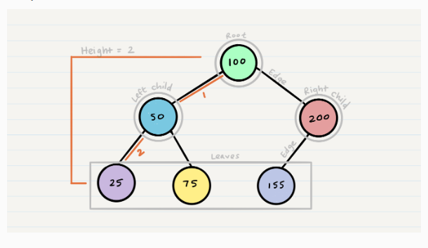

# Analogy
A tree can be thought of as a family tree, with the root node representing the ancestor, and the child nodes representing the descendants.

# Detail in depth
A tree is a non-linear data structure, which means that the nodes are not arranged in a sequential order. This makes trees more efficient for storing and retrieving data than other data structures, such as linked lists.

A tree is made up of nodes, which are connected to each other by edges. Each node has a value and a list of child nodes. The root node is the top node in the tree, and it has no parent node. Child nodes are connected to their parent node by an edge.

Trees can be used to represent hierarchical relationships between data. For example, a tree can be used to represent the relationships between employees in a company. In this case, the root node would represent the CEO, and the child nodes would represent the employees.

# WHY, WHAT, HOW structure
Why: Trees are a useful data structure because they can be used to represent hierarchical relationships between data.
What: A tree is a data structure that consists of a set of nodes, where each node has a value and a list of child nodes.
How: The nodes are arranged in a hierarchy, with each node having at most one parent node, and any number of child nodes.
# Tutorial / walk through an example

To create a tree, you first need to create a root node. The root node can contain any data type, such as a string, an integer, or a float.
Once you have created the root node, you can then add child nodes to it. Child nodes can also contain any data type. You can add as many child nodes to a node as you want.
To find a node in a tree, you can use a recursive algorithm. The algorithm starts at the root node and recursively checks each child node until it finds the node with the desired value.
To delete a node from a tree, you can use a recursive algorithm. The algorithm starts at the root node and recursively checks each child node until it finds the node with the desired value. The algorithm then deletes the node and its child nodes.
# Quiz
What is a tree?
What are the different types of trees?
What are the properties of trees?
What are the applications of trees?
What are the advantages and disadvantages of using trees?
Vocabulary/definition list
Tree: A data structure that consists of a set of nodes, where each node has a value and a list of child nodes.
Node: A data structure that contains a value and a list of child nodes.
Parent node: A node that has child nodes.
Child node: A node that has a parent node.
Hierarchy: A tree-like structure of data.
# Cheat sheet
To create a tree, you first need to create a root node.
Child nodes can be added to a node.
You can add as many child nodes to a node as you want.
Trees can be used to represent hierarchical relationships between data.
Trees are efficient for storing and retrieving data.

# Diagram / visualization / cartoon of a topic




# Anthropomorphize the concepts, and write a conversation between them
```
Root node: "I am the root node. I am the ancestor of all the other nodes in the tree."
Child node 1: "I am a child node. I am a descendant of the root node."
Child node 2: "I am also a child node. I am a descendant of the root node."
```
## Build a map of the information


## Construct a fill-in-the-blank worksheet for the topic
# Fill in the blanks to complete the sentence about trees.

A tree is a data structure that consists of a set of _____, where each _____ has a value and a list of _____.